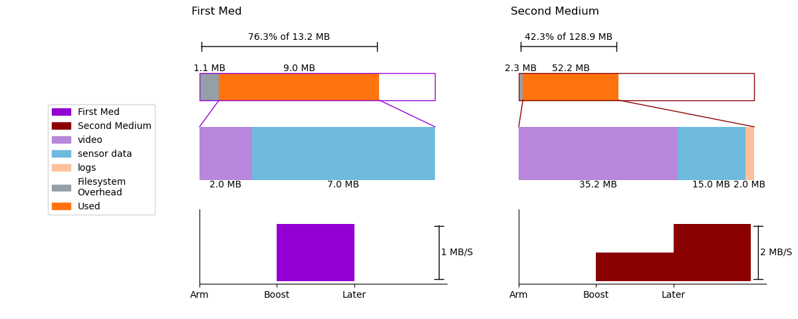

Requires Python3. Required modules: numpy, matplotlib.

Prompts the user to enter information about the data budget. Example input:
```
Number of storage media: 2
Medium 1 name: Backplane
        Total capacity (MB): 128
        Filesystem overhead (MB): 1
        Number of data types: 1
                Medium 1 Type 1 Name: Sensor Data
                        Size (MB): 63
Medium 2 name: Runcam
        Total capacity (MB): 128.1
        Filesystem overhead (MB): 5.1
        Number of data types: 2
                Medium 2 Type 1 Name: Video
                        Size (MB): 65
                Medium 2 Type 2 Name: Sensor Data
                        Size (MB): 12
Number of events:1
        Initial rates:
                Backplane (MB/s): 2
                Runcam (MB/s): 0.1
        Event 1 name:Boost
                Backplane (MB/s): 6
                Runcam (MB/s): 18
```
Example output:

